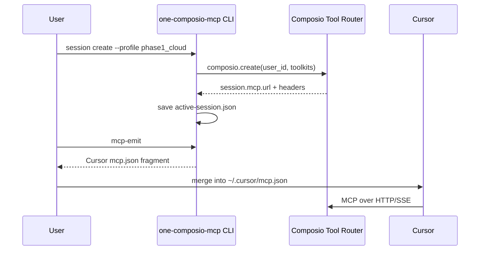

# Architecture

The one-composio-mcp bridge wraps Composio Tool Router sessions to produce HTTP MCP configs for Cursor, Claude Desktop, and other HTTP-capable MCP clients.

## Session Flow

## Components

| Module | Responsibility |
|--------|----------------|
| `config.py` | Load YAML profiles; resolve API key and user_id from env |
| `profiles.py` | Map profile names to Tool Router session options |
| `composio_client.py` | Thin Composio SDK wrapper |
| `session_manager.py` | `create()` / `use()` Tool Router sessions |
| `state.py` | Persist active session to `.one-composio-mcp/` |
| `mcp_emitter.py` | Emit Cursor-compatible `mcpServers` JSON |
| `connections.py` | Auth link formatting and toolkit status |
| `cli.py` | Typer CLI entry point |

## Design Decisions

- **Tool Router over Connect:** Sessions use `composio.create()` with scoped toolkits instead of the static Connect URL.
- **HTTP MCP only:** No local stdio proxy; clients must support HTTP MCP.
- **Stable user_id:** Connected accounts bind to `user_id`, not session; sessions can be recreated without losing OAuth.
- **Phased profiles:** `config.example.yaml` defines phase0–phase3 rollout profiles.

## References

- [Composio Tool Router docs](https://docs.composio.dev)
